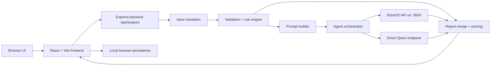

# AuditMind AI

AuditMind AI is a Solidity security copilot that combines deterministic rule checks with AI-assisted reasoning. It ships as a full-stack app with a React frontend, an Express backend, and an internal ElizaOS runtime that can route analysis through ElizaOS and Qwen.

## What The Project Does

- Analyzes Solidity from pasted code, uploaded files, public GitHub URLs, and verified contract addresses.
- Detects common high-signal patterns such as access control issues, external call risks, reentrancy signals, `delegatecall`, `selfdestruct`, `tx.origin`, mint/burn powers, and withdrawal/admin controls.
- Produces a structured report with a contract summary, risks, recommendations, evidence-style reasoning, source status, and a final verdict.
- Tracks whether a result came from rule-only analysis, direct Qwen analysis, or Eliza-routed analysis.
- Includes UI pages for analysis, history, saved reports, compare, settings, about, and local-only auth/session handling.
- Supports Docker-based packaging and a Nosana deployment template.

## Current Architecture



## Main Components

| Area | Files | Purpose |
| --- | --- | --- |
| Frontend shell | `src/frontend/App.jsx`, `src/frontend/components/Layout.jsx` | Routes, navigation, runtime status, top-level layout |
| Frontend pages | `src/frontend/pages/*` | Home, auth, analyze, history, saved reports, compare, settings, about |
| Frontend store | `src/frontend/store/useStore.js` | Local persistence for auth, history, saved reports, compare state, settings |
| Frontend API adapter | `src/frontend/services/api.js` | Calls backend endpoints and transforms backend reports for the UI |
| Backend server | `src/server.ts` | Serves API routes, health endpoints, tooling status, and the built frontend |
| Input resolution | `src/backend/services/inputResolver.ts` | Resolves Solidity from code, upload, GitHub, or contract address |
| Analyzer | `src/backend/services/analyzer.ts` | Merges rule-based findings and agent output into the final report |
| Agent layer | `src/backend/services/agentAnalyzer.ts`, `src/backend/services/elizaAgent.ts`, `src/backend/services/qwenClient.ts` | Eliza-first AI orchestration with Qwen fallback |
| Rule engine | `src/backend/utils/ruleChecks.ts` | Feature detection, rule flags, rule-generated risks, and summary generation |
| Prompting | `src/backend/services/promptBuilder.ts` | Builds the strict JSON prompt used for AI contract review |
| Eliza project | `src/index.ts`, `src/character.ts`, `src/plugin.ts` | ElizaOS project entry, character config, and starter plugin wiring |

## Supported Analysis Inputs

| Input type | Source | Notes |
| --- | --- | --- |
| Paste code | Raw Solidity text | Fastest path for local/manual review |
| Upload files | Single or multiple `.sol` files | Files are bundled into one analysis payload |
| GitHub URL | Public GitHub repo, tree, blob, or raw file URL | Current resolver fetches up to 20 Solidity files |
| Contract address | Verified source via Sourcify | Current implementation targets chain id `1` and requires verified metadata |

## Report Output

The merged report is built from backend evidence and rendered in the analyzer UI. Typical sections and tabs include:

- Contract Summary
- Risks
- Recommendations
- Agent Reasoning
- Source
- Evidence
- Auto-Fix
- Admin Powers

Backend reports also include:

- `verdict`: `Safe`, `Caution`, or `High Risk`
- `riskScore`: numeric score capped at `100`
- `detectedFeatures`
- `ruleFlags`
- `sourceAnalysis.validationPassed`
- `sourceAnalysis.ruleEngineUsed`
- `sourceAnalysis.elizaAgentUsed`
- `sourceAnalysis.qwenEndpointUsed`
- `sourceAnalysis.analysisMode`

## Local Development

### Prerequisites

- Node.js
- Bun
- npm

Optional but useful:

- Docker Desktop
- A Qwen-compatible endpoint for direct fallback
- GitHub token for higher GitHub API limits

### Install

```bash
npm install
```

### Run the Full App Locally

Use separate terminals:

```bash
# Terminal 1: Eliza runtime on port 3000
npm run dev

# Terminal 2: AuditMind backend on port 3001
npm run backend

# Terminal 3: AuditMind frontend on port 5173
npm run frontend
```

Open the frontend at `http://localhost:5173`.

### Production Build

```bash
npm run build
```

This generates:

- `dist/index.js` for the Eliza project bundle
- `dist/server.js` for the compiled backend
- `dist/frontend` for the production frontend

## Key Scripts

| Command | Purpose |
| --- | --- |
| `npm run dev` | Start ElizaOS development runtime |
| `npm run backend` | Run the AuditMind backend from TypeScript |
| `npm run frontend` | Run the Vite frontend in dev mode |
| `npm run build` | Build frontend and runtime artifacts |
| `npm run type-check` | TypeScript verification |
| `npm test` | Full test suite |
| `npm run repair:eliza-cli` | Reapply the local CLI patch for Windows/npm spawn issues |

## Environment Variables

Important runtime variables used by the app:

| Variable | Purpose |
| --- | --- |
| `ELIZAOS_API_KEY` | ElizaOS/ElizaCloud authentication |
| `ELIZA_AUDIT_API_URL` | URL for the Eliza audit runtime, usually `http://localhost:3000` |
| `ELIZA_AUDIT_API_KEY` | Optional explicit key for the Eliza audit route |
| `ELIZA_AUDIT_MODEL` | Model name used for Eliza-routed analysis |
| `QWEN_API_URL` | Optional direct Qwen/OpenAI-compatible fallback endpoint |
| `QWEN_API_KEY` | Optional API key for the direct Qwen endpoint |
| `QWEN_MODEL` | Direct-model fallback name |
| `PGLITE_DATA_DIR` | Local Eliza database path |
| `PORT` | AuditMind backend port, default `3001` |
| `FRONTEND_ORIGIN` | CORS/dev frontend origin |
| `VITE_API_BASE` | Optional frontend API base override |
| `GITHUB_TOKEN` | Optional GitHub API token for resolver requests |

Do not commit real secrets to git.

## API Endpoints

| Route | Purpose |
| --- | --- |
| `GET /health` | Backend health |
| `GET /api/tooling-status` | Checks `slither` and `forge` availability |
| `POST /api/analyze` | Main analysis endpoint |

## Docker And Nosana

The repo includes:

- `Dockerfile`
- `scripts/start-auditmind.sh`
- `nosana-deployment.template.json`

The container starts:

- ElizaOS on internal port `3000`
- AuditMind backend/frontend on port `3001`

### Docker build

```bash
docker build -t YOUR_REGISTRY_USERNAME/auditmind:latest .
```

### Nosana

Use `nosana-deployment.template.json` as the starting template in the Nosana dashboard. Replace:

- the image name
- the market address
- the API key placeholders

Expose only port `3001` and keep the Eliza runtime internal on `3000`.

## Project Structure

```text
auditmind/
|-- docs/
|   `-- agent-workflow.md
|-- sample-contracts/
|-- scripts/
|   `-- start-auditmind.sh
|-- src/
|   |-- backend/
|   |-- frontend/
|   |-- __tests__/
|   |-- character.ts
|   |-- index.ts
|   `-- plugin.ts
|-- Dockerfile
|-- build.ts
|-- nosana-deployment.template.json
`-- README.md
```

## Testing

```bash
npm run type-check
npm run build
npm test
```

The current suite covers:

- build-order integration
- project structure
- character and plugin wiring
- provider/action/service behavior
- route and config validation

## Sample Contracts

Sample Solidity files for demos and regression checks live in `sample-contracts/`. See `sample-contracts/README.md` for a contract-by-contract guide.

## Current Scope Notes

- Local auth is browser-persisted and not backed by a server database yet.
- GitHub analysis currently supports public GitHub sources only.
- Contract address analysis depends on Sourcify verification.
- The Eliza project still includes starter-template plugin code for runtime/test compatibility, alongside the custom AuditMind backend and UI.

## Documentation Map

- Root project overview: `README.md`
- Analysis pipeline: `docs/agent-workflow.md`
- Sample contracts: `sample-contracts/README.md`
- Product brief and roadmap: `idea.md`
- Contributor guide: `CLAUDE.md`
