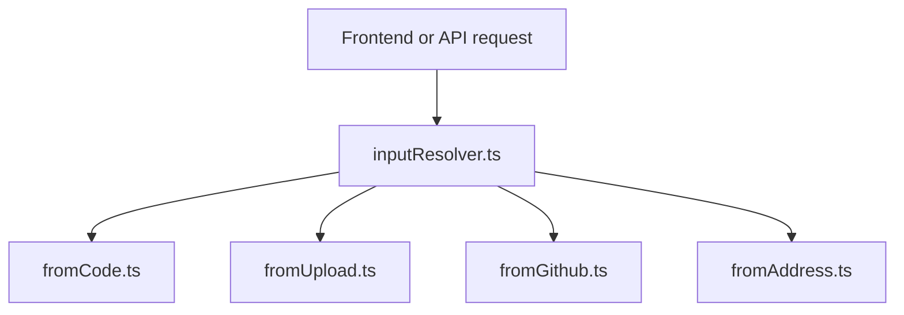
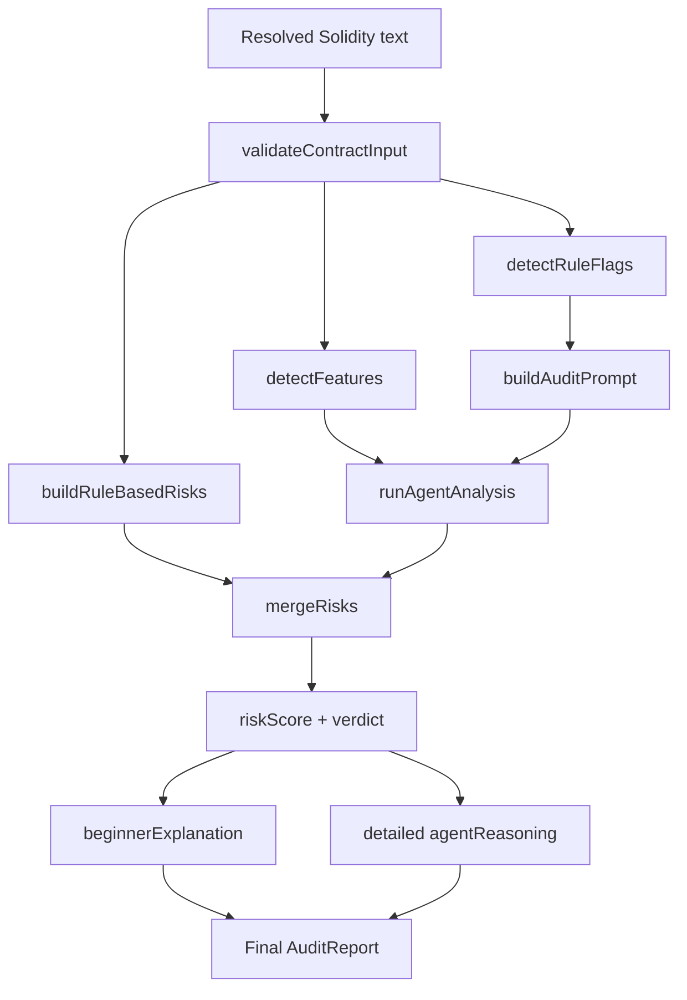

# AuditMind AI Agent Workflow

This document describes the current analysis pipeline implemented in the repository.

## Goal

AuditMind AI helps users review Solidity contracts by combining deterministic rule checks with AI-generated reasoning. The backend is designed to stay useful even when an AI provider is unavailable by falling back to rule-based analysis.

## Supported Inputs

The backend currently resolves Solidity from four input types:

1. `code`
2. `upload`
3. `github`
4. `address`

## Resolution Flow

### Input-specific behavior

- `code`: uses the submitted Solidity directly.
- `upload`: bundles one or more uploaded files into a single analysis string with file headers.
- `github`: fetches public Solidity files from GitHub. Repo/tree URLs can resolve multiple files; blob/raw URLs resolve a single file.
- `address`: fetches verified source metadata and Solidity files from Sourcify. Current implementation targets chain id `1`.

## Analysis Pipeline

## Core Steps

### 1. Validation

`validateContractInput` rejects empty or obviously invalid Solidity payloads before expensive analysis runs.

### 2. Deterministic rule pass

The rule engine extracts:

- `ruleFlags`
- `detectedFeatures`
- rule-generated `possibleRisks`
- a fallback contract summary

These rule signals are used even when AI is available.

### 3. Prompt generation

`buildAuditPrompt` creates a strict JSON instruction set for the AI layer. The prompt requests:

- contract summary
- risk array
- beginner explanation
- detailed reasoning
- attack surface
- evidence signals
- priority review areas
- confidence notes

### 4. Agent orchestration

`runAgentAnalysis` tries the following order:

1. Eliza-routed analysis
2. Direct Qwen endpoint
3. Fallback rule-only mode

Possible provider outcomes:

- `eliza-qwen`
- `qwen-direct`
- `fallback`

### 5. Risk merge and scoring

AI risks are merged into the rule-based findings by `id`. The backend then computes:

- `riskScore`
- `verdict`

Verdict rules:

- `High Risk` if any risk is `High`
- `Caution` if score is at least `20`
- `Safe` otherwise

### 6. Narrative expansion

If the AI response is too short, the backend expands it using:

- rule flags
- detected features
- merged risks
- verdict context

This keeps the UI useful even when the model returns terse output.

## Output Shape

The backend returns an `AuditReport` with these main fields:

- `contractSummary`
- `possibleRisks`
- `verdict`
- `riskScore`
- `beginnerExplanation`
- `detectedFeatures`
- `ruleFlags`
- `agentReasoning`
- `sourceAnalysis`

`sourceAnalysis` includes:

- `validationPassed`
- `ruleEngineUsed`
- `elizaAgentUsed`
- `qwenEndpointUsed`
- `analysisMode`

## Frontend Consumption

The frontend adapter in `src/frontend/services/api.js` transforms backend output into UI-friendly sections. The analyzer page then renders the report across multiple tabs such as:

- Summary
- Risks
- Recommendations
- Agent Reasoning
- Source
- Evidence
- Auto-Fix
- Admin Powers

## Failure Handling

The backend degrades gracefully:

- invalid input returns `400`
- resolution or runtime errors return `500`
- agent endpoint failures fall back to rule-based analysis
- source status still records which layers were used

## Current Constraints

- GitHub mode currently supports public GitHub sources only.
- GitHub repo tree mode limits fetched Solidity files to `20`.
- Contract address mode depends on Sourcify verification.
- Eliza availability depends on a reachable runtime at `ELIZA_AUDIT_API_URL`.
- Direct Qwen fallback depends on an OpenAI-compatible endpoint at `QWEN_API_URL`.

## Practical Reading Of Results

- `elizaAgentUsed: true` means Eliza successfully handled the AI path.
- `qwenEndpointUsed: true` can mean either Eliza used Qwen behind the scenes or the backend used direct Qwen fallback.
- `analysisMode: fallback` means only deterministic analysis was available.
- `ruleEngineUsed: true` is expected for every normal analysis run in this project.
